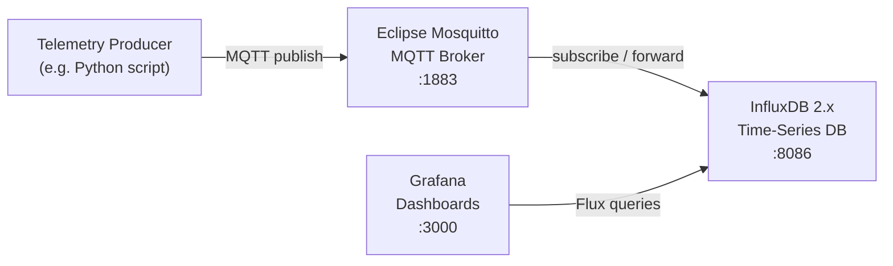

# Design Document: GreenPulse Telemetry POC

## Overview

GreenPulse is a local, containerized telemetry stack for monitoring AI workload energy consumption. The entire system is defined in a single `docker-compose.yml` file and starts with one command. Three services form the pipeline: Mosquitto receives telemetry over MQTT, InfluxDB stores it as time-series data, and Grafana visualizes it via dashboards. All state is persisted to Docker-managed named volumes.

---

## Architecture



All three services run on the same Docker Compose default network, so they can reach each other by service name (e.g. `influxdb:8086`).

---

## Components and Interfaces

### Eclipse Mosquitto (MQTT Broker)

- Image: `eclipse-mosquitto:2.0`
- Exposed port: `1883` (MQTT)
- Configuration: a minimal `mosquitto.conf` that enables anonymous connections for local dev
- Volume: `mosquitto_data` mounted at `/mosquitto/data`
- Volume: `mosquitto_config` mounted at `/mosquitto/config`

### InfluxDB 2.x

- Image: `influxdb:2.7`
- Exposed port: `8086` (HTTP API + UI)
- Initialization via environment variables (InfluxDB 2.x auto-setup mode):
  - `DOCKER_INFLUXDB_INIT_MODE=setup`
  - `DOCKER_INFLUXDB_INIT_USERNAME=admin`
  - `DOCKER_INFLUXDB_INIT_PASSWORD=adminpassword`
  - `DOCKER_INFLUXDB_INIT_ORG=GreenPulse`
  - `DOCKER_INFLUXDB_INIT_BUCKET=telemetry`
  - `DOCKER_INFLUXDB_INIT_ADMIN_TOKEN=greenpulse-dev-token`
- Volume: `influxdb_data` mounted at `/var/lib/influxdb2`
- Volume: `influxdb_config` mounted at `/etc/influxdb2`

### Grafana

- Image: `grafana/grafana:10.4.2`
- Exposed port: `3000` (HTTP UI)
- Volume: `grafana_data` mounted at `/var/lib/grafana`

---

## Data Models

This POC does not define application-level data models. Data flows as MQTT payloads (typically JSON) into InfluxDB line protocol records. The schema is defined by the telemetry producer at publish time.

Example MQTT payload (JSON):
```json
{
  "measurement": "gpu_power",
  "tags": { "host": "dev-machine", "model": "RTX 4090" },
  "fields": { "watts": 320.5 },
  "timestamp": 1718000000000000000
}
```

---

## Correctness Properties

*A property is a characteristic or behavior that should hold true across all valid executions of a system — essentially, a formal statement about what the system should do. Properties serve as the bridge between human-readable specifications and machine-verifiable correctness guarantees.*

### Property 1: All services are declared with correct ports

*For any* valid `docker-compose.yml` produced by this spec, the file must declare exactly three services — one for Mosquitto on port 1883, one for InfluxDB on port 8086, and one for Grafana on port 3000.

**Validates: Requirements 1.1, 2.1, 3.1, 5.1**

---

### Property 2: All service images are pinned to specific versions

*For any* service defined in the `docker-compose.yml`, the image tag must be an explicit version string and must not be `latest` or absent.

**Validates: Requirements 5.3**

---

### Property 3: Named volumes are declared and mounted for every service

*For any* service in the `docker-compose.yml`, at least one named volume must be declared in the top-level `volumes` section and mounted into that service's container. No bind mounts (paths starting with `./` or `/`) should be used for persistence.

**Validates: Requirements 1.3, 2.5, 3.3, 4.1, 4.3**

---

### Property 4: InfluxDB initialization environment variables are all present and non-empty

*For any* valid `docker-compose.yml` produced by this spec, the InfluxDB service must define all five required initialization environment variables (`DOCKER_INFLUXDB_INIT_MODE`, `DOCKER_INFLUXDB_INIT_ORG`, `DOCKER_INFLUXDB_INIT_BUCKET`, `DOCKER_INFLUXDB_INIT_ADMIN_TOKEN`, `DOCKER_INFLUXDB_INIT_USERNAME`) and none of them may be empty.

**Validates: Requirements 2.2, 2.3, 2.4**

---

### Property 5: InfluxDB org and bucket values match specification

*For any* valid `docker-compose.yml` produced by this spec, `DOCKER_INFLUXDB_INIT_ORG` must equal `"GreenPulse"` and `DOCKER_INFLUXDB_INIT_BUCKET` must equal `"telemetry"`.

**Validates: Requirements 2.2, 2.3**

---

## Error Handling

Since this is a Docker Compose infrastructure POC, error handling is primarily at the container level:

- **Missing config**: If `mosquitto.conf` is absent, Mosquitto will fail to start. The compose file must supply a valid config file or inline configuration.
- **InfluxDB re-initialization**: If `DOCKER_INFLUXDB_INIT_MODE=setup` is set but the data volume already contains an initialized database, InfluxDB will skip re-initialization silently. This is the correct behavior for restarts.
- **Port conflicts**: If host ports 1883, 8086, or 3000 are already in use, Docker Compose will fail with a clear bind error. No special handling is needed beyond documenting this in the README.
- **Volume removal**: If a user runs `docker compose down -v`, all named volumes are deleted. This is intentional and documented behavior.

---

## Testing Strategy

### Dual Testing Approach

Both unit/structural tests and integration tests are used:

- **Structural tests** (unit-level): Parse the `docker-compose.yml` file as YAML and assert structural properties without starting any containers. Fast, no Docker required.
- **Integration tests**: Start the stack with `docker compose up -d` and verify runtime behavior (port reachability, HTTP responses, MQTT connections).

### Property-Based Testing

The properties in this design are structural properties over the compose file's YAML content. Since the compose file is a single, deterministic artifact (not generated from random inputs), these are best validated as **example-based structural tests** rather than randomized property tests. The "for all" quantification applies across all services in the file.

**Testing library**: `pytest` with `PyYAML` for structural tests; `pytest` with `paho-mqtt` and `influxdb-client` for integration tests.

**Structural test configuration**:
- Each structural test parses `docker-compose.yml` once and asserts against the parsed dict
- Tests are tagged with the property they validate

**Tag format**: `Feature: green-pulse-telemetry, Property {N}: {property_text}`

### Test Coverage Map

| Property | Test Type | Description |
|---|---|---|
| Property 1 | Structural example | Assert services dict has mosquitto/influxdb/grafana with correct ports |
| Property 2 | Structural property | For each service, assert image tag is pinned |
| Property 3 | Structural property | For each service, assert named volume mounted; no bind mounts |
| Property 4 | Structural example | Assert all 5 InfluxDB env vars present and non-empty |
| Property 5 | Structural example | Assert org == "GreenPulse" and bucket == "telemetry" |

### Unit Testing Balance

- Structural tests cover all five correctness properties without needing a running Docker daemon
- Integration tests (optional, marked `*` in tasks) validate runtime behavior: TCP connect to 1883, HTTP GET to :8086/health, HTTP GET to :3000
- Avoid duplicating structural checks in integration tests
